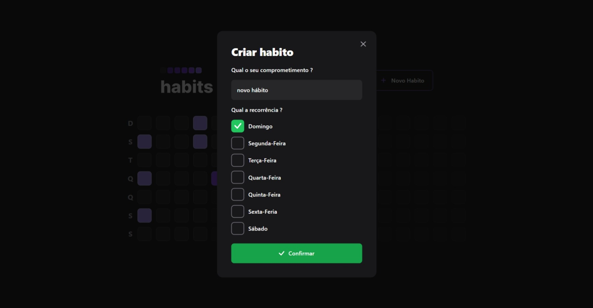
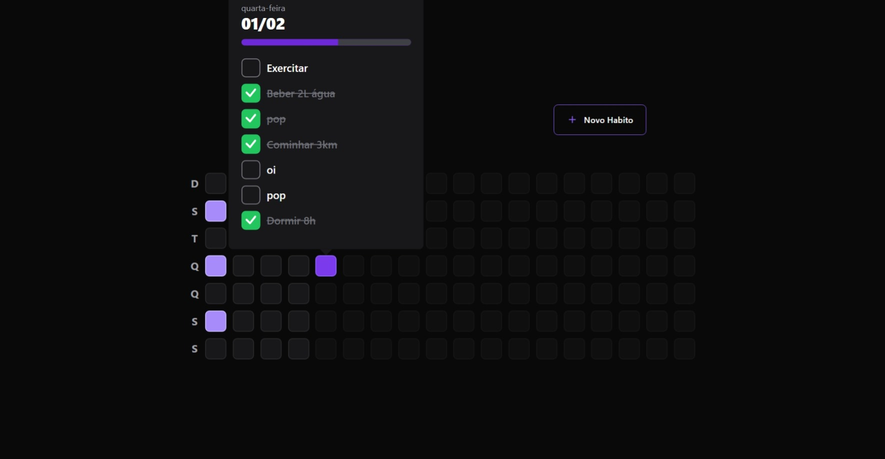
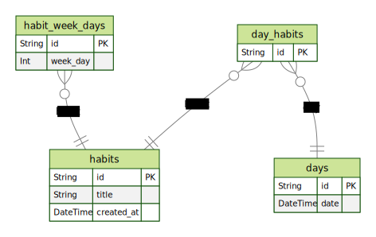

# Habit Tracker
Aplicação para gerenciar a criação de novos Hábitos pessoais 

<div align="center">
    
    
    <a href="https://github.com/AdySoares/NLW11-Setup/commits/main"> 
    
    </a>
    <a href="https://github.com/AdySoares/NLW11-Setup/blob/main/LICENSE">
    
    </a>
</div>
<div align="center" > 

[Images](#images) | [About](#about) | [Technologies](#technologies) | [How To Use](#use)| [License](#license)

</div>


## Images
<div  align="center" >




</div>


## About
<div>

Essa aplicação foi desenvolvida durante a Next Level Week (NLW) número 11, na trilha Ignite, organizada e apresentada pela @Rocketseat. A NLW demonstra de forma simples e inteligente como desenvolver um aplicativo na prática, usando o stack JavaScript (TypeScript, NodeJS, React, React Native, HTML e CSS). Os participantes têm a oportunidade de modificar o projeto de acordo com suas preferências.

    
    
A aplicação é um gerenciador de hábitos que permite gerenciar os hábitos completados no dia atual e visualizar o gerenciamento dos dias anteriores de forma bastante visual.
    
    
</div>

## Technologies
* [TypeSript](https://www.typescriptlang.org/)
* [NodeJS](https://nodejs.org/en/)
* [ReactJS](https://reactjs.org/)
* [React Native](https://reactnative.dev/)
* [Prisma](https://www.prisma.io/)
* [Expo](https://expo.dev/)

## Use
### Requisitos
    node >= v18.13.0
    npm >= 9.4.0

> Use o .env.exemple para criar seu .env próprio, caso queria usar um banco de dados diferente do SQLite entre no arquivo schema.prisma, presente no caminho /server/prisma/schema.prisma, e configure o datasource db do jeito que lhe agradar.

#### Execute em todas as pastas do projeto (server, web, mobile)
```zsh
yarn install
or
npm install
```

#### Na pasta serve execute o comando
```shell
npx prisma migrate dev
```
> isso criar o banco de dados com a estrutura correta do banco de dados e populara o mesmo com alguns dados. Segue o esquema de entidade e relacionamento do banco de dados abaixo



#### Start services (in server, web folders)
```shell
yarn dev
or
npm run dev
```

## License
This project is licensed under the MIT license. See the [LICENSE](LICENSE) file for more details.
